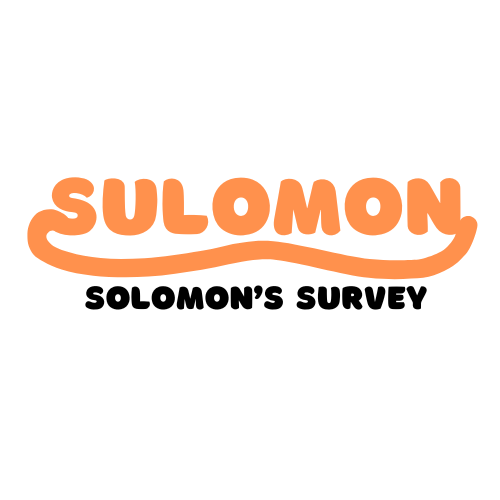
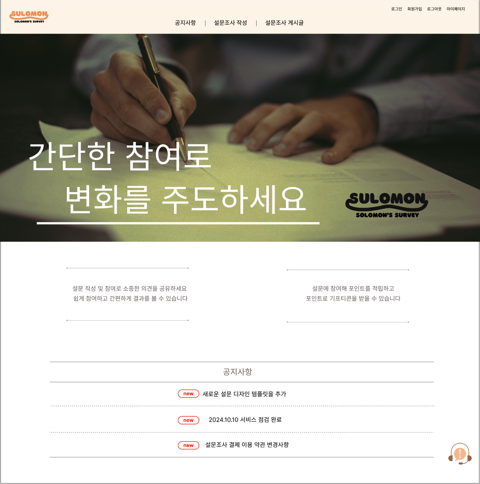

# Sulomon



## 프로젝트 개요

대학생 과제와 기업 활동 등 다양한 분야에서 설문조사가 자주 사용되지만, 자발적인 참여가 충분하지 않은 경우가 많다. <br>
자발적 참여를 촉진하기 위해 경품 추첨이나 기프티콘 제공 같은 방법이 사용되고 있지만, 이는 예산 부담이 크고 설문조사 스미싱과 같은 문제가 발생할 수 있는 단점이 있다. <br>
이러한 문제를 해결하기 위해, 기업의 예산 소모를 줄이고 참여자가 안전하고 자발적으로 참여할 수 있는 설문조사 플랫폼을 구축하고자 한다.

## 🚩 Table of Contents (목차)

1. [팀 구성](#팀-구성)
2. [기능](#기능)
3. [기능 요구 사항](#기능-요구-사항)
4. [기술 스택](#기술-스택)
5. [설치 및 실행](#설치-및-실행)
6. [사용법](#사용법)
7. [프로젝트 구조](#프로젝트-구조)
8. [연락처](#연락처)

>  <br>
> 설문조사를 만든 사람은 포인트를 정하여 설문조사를 만들 수 있다.
> 설문조사를 참여하는 사람은 참여를 통해 포인트를 얻고 해당 포인트로 기프티콘을 구매할 수 있다.

## 팀 구성

| 이름   | 팀 역할 | 역할 | 맡은 페이지 |                                                                                    깃허브                                                                                    |
| :----- | :-----: | :--- | :---------- | :--------------------------------------------------------------------------------------------------------------------------------------------------------------------------: |
| 임종현 |  팀장   | --   | --          |  <a href="https://github.com/hyurim"></a>   |
| 김수연 |  팀원   | --   | --          | <a href="https://github.com/tndus0804"></a> |
| 이세미 |  팀원   | --   | --          |  <a href="https://github.com/dlpmi99"></a>  |
| 전주영 |  팀원   | --   | --          | <a href="https://github.com/youngam44"></a> |

## 기능

- 사용자 인증 및 권한 관리
  - 로그인 및 로그아웃
    - 로그인 페이지에서 일반 로그인, 소셜 로그인 가능
    - 로그아웃 기능 제공
  - 회원가입
    - 회원가입 시 아이디, 비밀번호, 이름, 성별, 생년월일 등의 정보 입력
    - 관심사 최대 3개 선택
  - 아이디 및 비밀번호 찾기
    - 아이디 찾기 시 이름과 이메일 입력
    - 비밀번호 찾기 시 이름, 아이디, 이메일 입력
  - 관리자 권한 관리
    - 관리자 페이지에서 유저 탈퇴 및 권한 변경 가능
      <br>
- 게시글 작성, 수정, 삭제
  - 설문조사 게시글 작성
    - 설문조사 작성 시 관심사 3개까지 설정 가능
    - 포인트 입력 기능
      - 설문조사 작성
        - 이미지를 글자로 추출할 수 있다.
  - 공지사항 게시글 작성
    - 관리자 권한을 가진 사람만 공지사항 작성, 수정, 삭제 가능
  - 게시글 수정 및 삭제
    - 설문조사 게시글 작성자는 게시글 수정 가능(설문 폼 수정은 불가)
    - 관리자는 게시글 삭제 가능
      <br>
- 댓글 및 답글 시스템
  - 댓글 작성
    - 설문조사 상세 페이지에서 댓글 작성 가능
    - 본인 및 관리자만 댓글 수정, 삭제 가능
    - 댓글 작성 시 작성일, 시간, 이름, 댓글 내용 표시
      <br>
- 게시글 검색 및 필터링
  - 설문조사 게시판
    - 설문조사 게시글 검색 가능
    - 최대 3개의 카테고리로 게시글 필터링 가능
    - 페이지네이션 기능 제공
      <br>
- 사용자 프로필 관리
  - 마이페이지
    - 회원 정보 수정 (아이디, 이름, 생년월일, 성별은 수정 불가)
    - 참여한 설문조사, 내가 만든 설문조사, 포인트 내역 확인
    - 회원 탈퇴 가능
    - 기프티콘 구매 및 전송 가능
      <br>

### 기능 요구 사항

[frontEnd](./front/README.md)
[backEnd](./backend/README.md)

## 기술 스택

- **프론트엔드**: HTML, CSS, JavaScript, React.js
- **백엔드**: Spring
- **데이터베이스**: MySQL

## 설치 및 실행

### 1. 클론 리포지토리

```bash
git clone https://github.com/your-username/ses_project.git
cd ses_project
```

### 2. 실행 전 주의 사항

실행 전 주의사항 내용

1. Node 22.3.0 버전 이상
2. React 18.3.1 버전 이상
3. Java 17 버전

### 3. 의존성 설치

```bash
npm install
```

### 4. 개발 서버 실행

```bash
npm start
```

서버가 `http://localhost:3000`에서 실행됩니다.

## 사용법

1. `http://localhost:3000`으로 이동합니다.
2. 회원가입 후 로그인합니다.
3. 설문조사를 작성 후 게시글을 작성합니다.
4. 설문조사를 참여하여 포인트를 획득합니다.
5. 적립한 포인트로 기프티콘을 구매합니다.

## 프로젝트 구조

```plaintext
your-project/
│
├── public/              # 정적 파일 (이미지, 폰트, ...)
├── src/
│   ├── components/      # React 컴포넌트
│   ├── pages/           # 페이지 컴포넌트
│   ├── services/        # API 호출 서비스
│   ├── App.js           # 애플리케이션 엔트리 포인트
│   └── index.js         # ReactDOM 렌더링
│
├── .env                 # 환경 변수 파일
├── package.json         # 프로젝트 메타데이터 및 의존성
└── README.md            # 프로젝트 설명 파일
```

## 연락처

프로젝트 관련 문의사항이 있으시면 [yimjh2309@gmail.com](mailto:yimjh2309@gmail.com)으로 메일 부탁드립니다.
